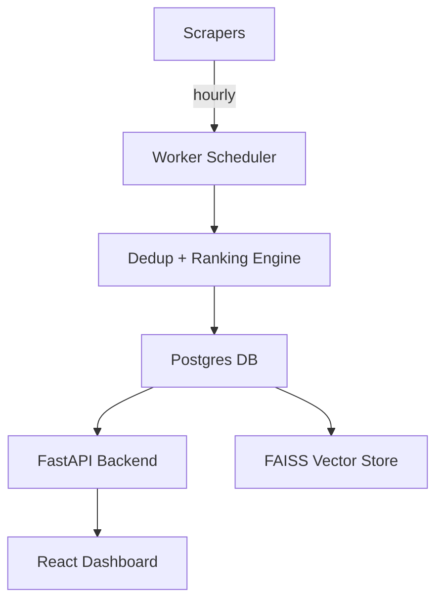

# Internship Tracker Pro 🚀  
[](../../actions)
[](https://www.docker.com/)
[](LICENSE)

AI-powered Job Aggregator & Application Tracker


Internship Tracker Pro is an **end-to-end open-source platform** to help students and professionals **discover, rank, and track internships** across multiple job boards and portals. It combines **modern data engineering**, **AI-powered ranking**, and a **beautiful React dashboard** into one production-grade system.

---

## ✨ Why this project?
Finding internships is frustrating:  
- Dozens of job boards to check manually  
- Duplicate postings everywhere  
- Hard to know which jobs actually fit your skills  
- No single place to track “Applied / Saved / Cold emailed”  

This project fixes that by becoming your **personal AI recruiting assistant**.

---

## 🔑 Key Features
- **Multi-source aggregation** (Jobright, Indeed, USC portal, Handshake, LinkedIn template connectors)  
- **Data engineering at scale**: Postgres + Alembic migrations, worker pipelines, hourly scheduler  
- **AI ranking engine**: Sentence-BERT embeddings + skills heuristics + location filters  
- **Vector search ready**: FAISS integration for semantic JD ↔ resume matching  
- **Full CRUD APIs**: FastAPI backend with pagination, filters, typed schemas  
- **Modern UI**: React + Vite + Material UI for applied/saved tracking, notes, pagination  
- **Dockerized dev/prod**: `docker compose up` brings the whole stack online  
- **Seeded demo data**: Works offline immediately; swap connectors to go live  
- **CI pipeline**: GitHub Actions workflow for linting & backend imports  

---

## 🏗️ Architecture


---

## 🚀 Quickstart
```bash
git clone https://github.com/your-username/internship-tracker-pro.git
cd internship-tracker-pro
cp .env.example .env

docker compose up --build

# API docs: http://localhost:8000/docs
# UI:       http://localhost:5173
```

---

## 🖥️ Demo Screenshots
  
  

---

## 🛠️ Tech Stack
- **Data Engineering**: Postgres, SQLAlchemy, Alembic  
- **AI / ML**: Sentence-Transformers, FAISS, RapidFuzz  
- **Backend**: FastAPI, Pydantic v2, Uvicorn  
- **Frontend**: React 18, Vite, Material UI  
- **DevOps**: Docker, GitHub Actions CI/CD  

---

## 📊 Sample Data
- HPE – Data Engineer Intern  
- CapTech – AI/ML Engineer Intern  
- USC ITS – Business Intelligence Intern  
- Servify – Software Engineer Intern  

---

## 📌 Roadmap
- [ ] LinkedIn & Handshake Playwright connectors  
- [ ] Automated cold-email drafting with LLM prompts  
- [ ] Slack/Email alerts for >80% match jobs  
- [ ] User auth + multiple profiles  
- [ ] Analytics dashboards (dbt + Power BI/Tableau)  

---

## 🤝 Contributing
PRs and feature requests are welcome! See [Issues](../../issues).  
Intended for **educational & career use**. Respect site ToS when scraping.

---

## 💡 Why this matters for recruiters & hiring managers
- Shows **practical data engineering & AI skills** (ETL pipelines, dedup, embeddings, ranking)  
- Demonstrates **end-to-end ownership** (frontend, backend, infra, ML integration)  
- Solves a **real, painful problem** for students and early-career professionals  
- Codebase is **clean, Dockerized, production-oriented** → deployable immediately  

---

## 👤 Author

**Alpesh Shinde**  
🎓 MS CS @ USC | Data Engineering • Data Science • AI/ML • SWE  
🌍 Passion for food, travel, and building impactful tech.  

[LinkedIn](https://www.linkedin.com/in/alpeshshinde/) • [GitHub](https://github.com/alpeshrocks) • [Portfolio](https://alpeshrocks.github.io/alpesh-portfolio/)

---

## 📜 License
This project is licensed under the MIT License — free to use and adapt.
